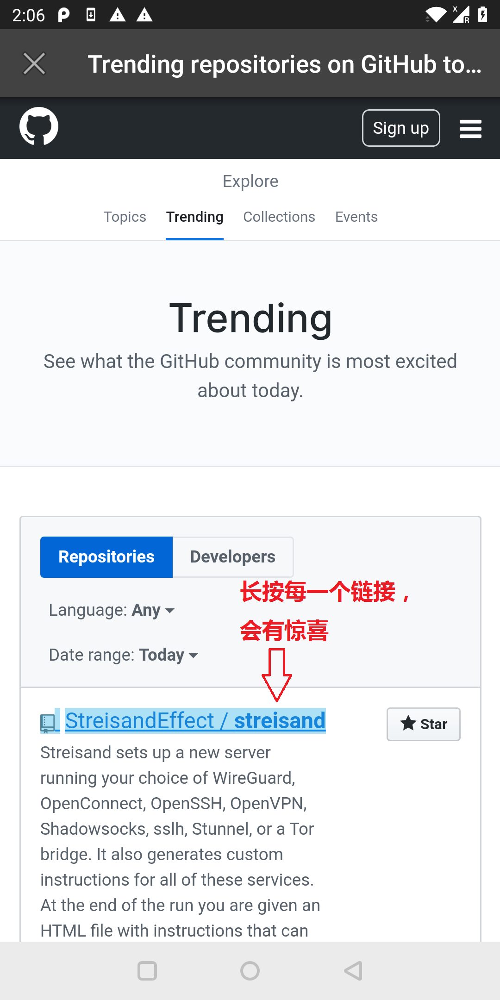
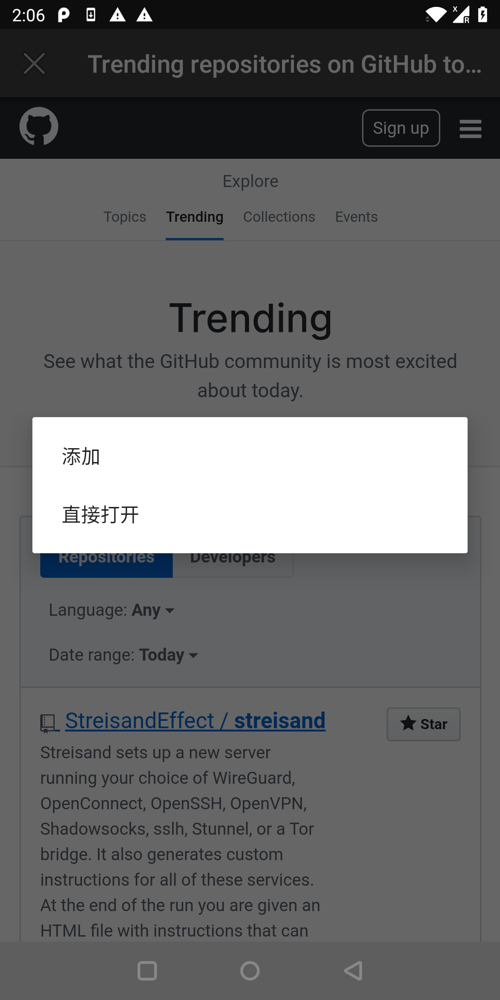
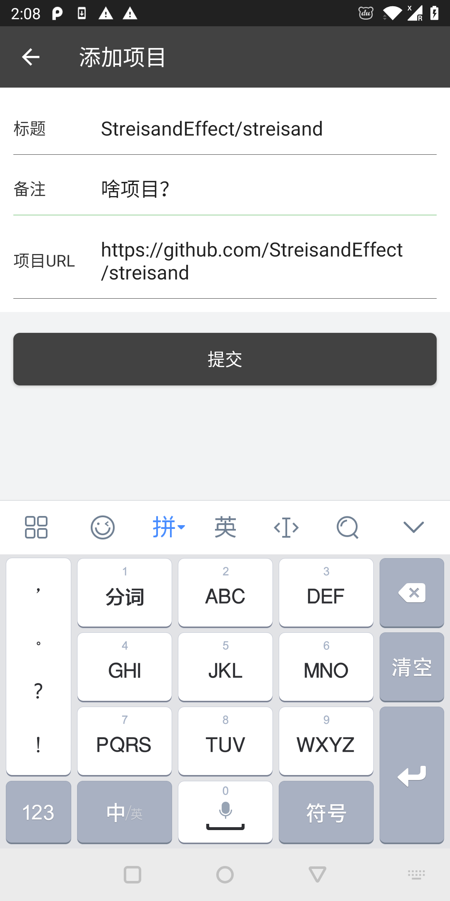
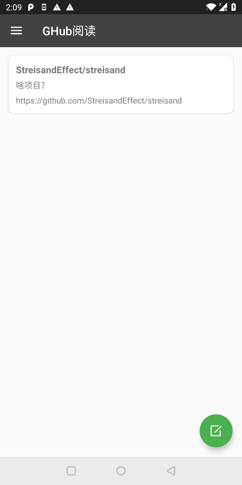
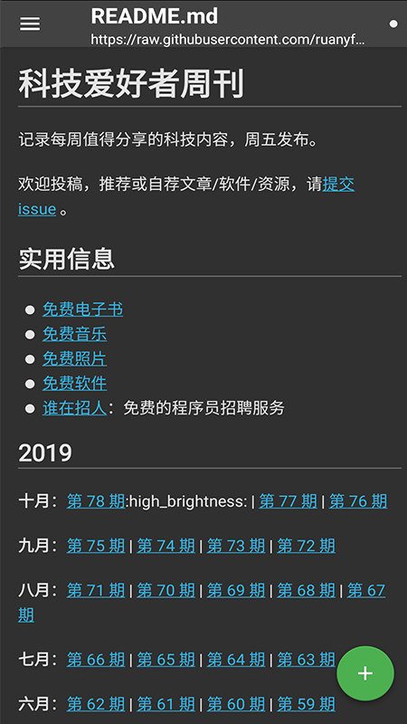
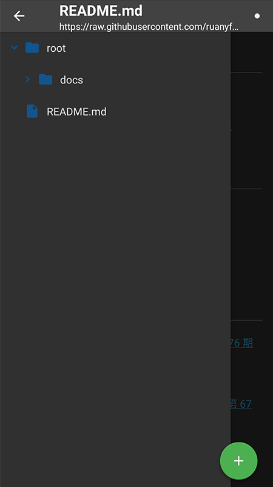

# GHubReader
首个最好用的GitHub MD电子书阅读器

# GitHub阅读器使用说明

1. 首先打开GitHub页面，如何登陆账号的话，可以不用每次都登陆

2. 打开需要添加的项目

**长按所有链接都可以添加成本地项目，或直接打开用阅读器阅读。** 
**这样方便用户的添加流程**

3.添加为本地项目 
  **添加项目后，直接在目录点击阅读，不需要每次都上网查找**

4.项目、电子书阅读 
  **在添加后的项目列表，直接点击项目，可以跳转到阅读界面**

  **目前，支持MD阅读、code 代码阅读、直接用web阅读**

  **左侧有目录栏，可以直接点击其它页面阅读，解决目前GitHub阅读的痛点** 
  **第一次打开项目时，项目的目录获取会比较耗时间，请见谅一下，毕竟目前访问GitHub官网请求时间有点长**

